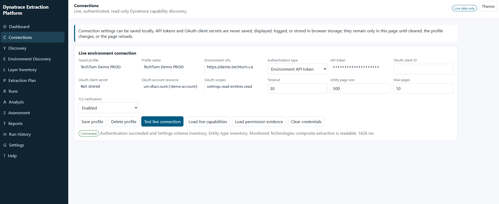
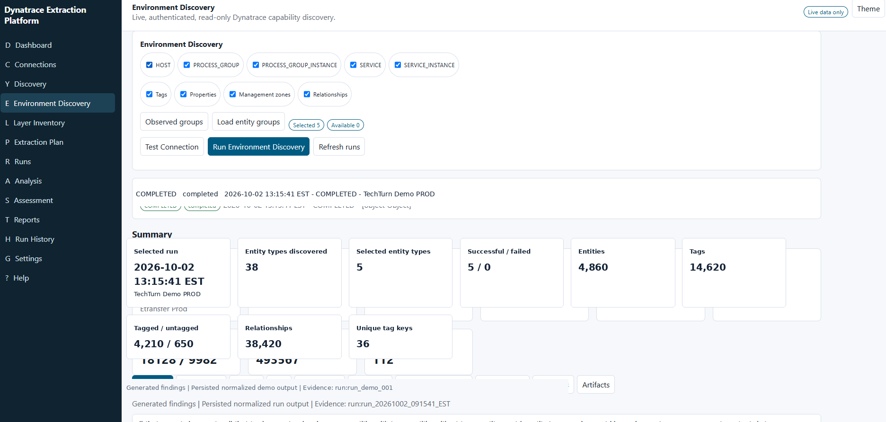
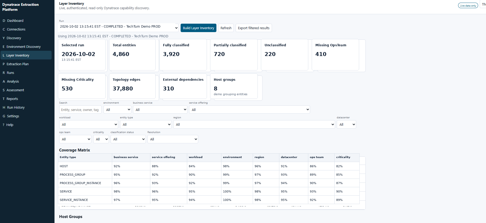
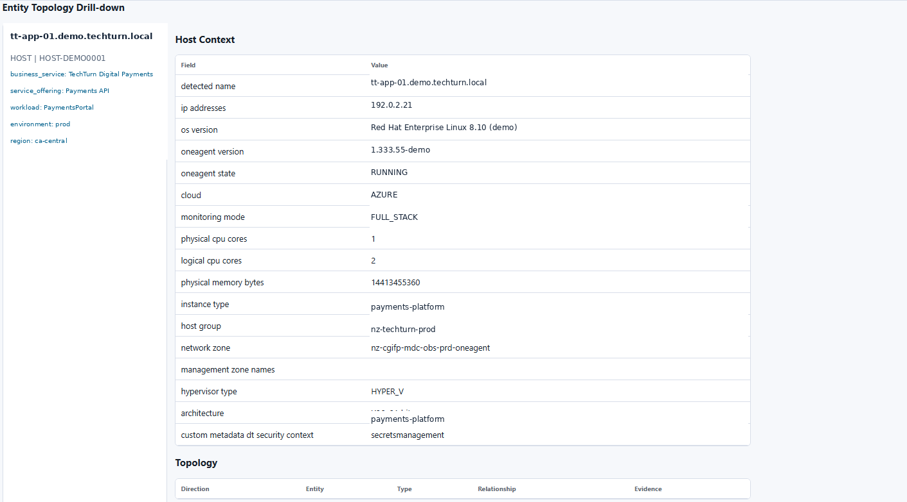
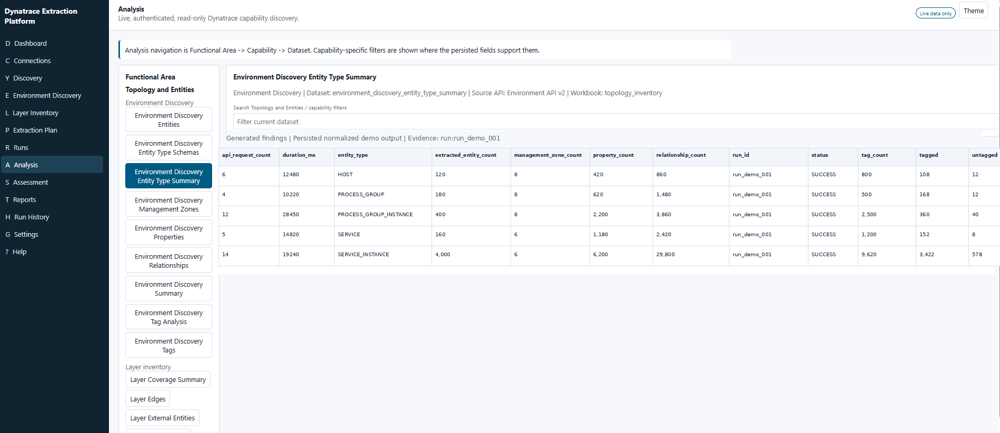
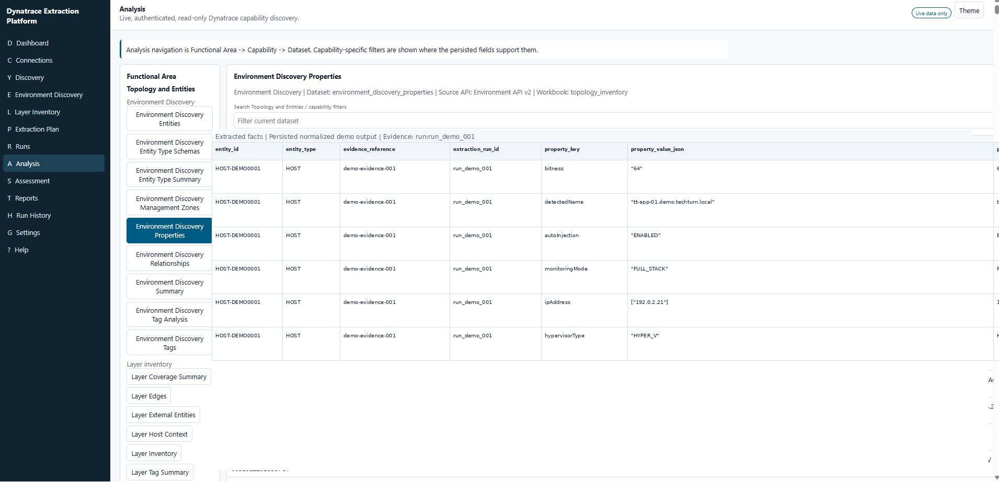
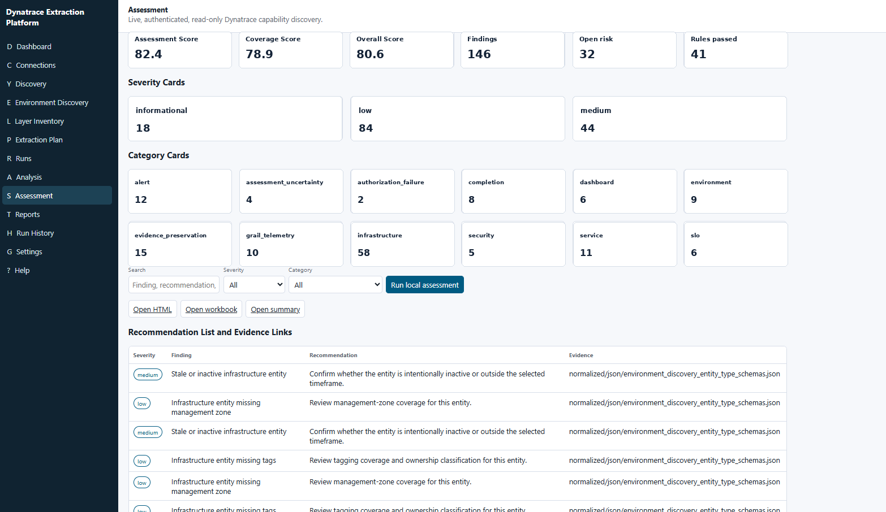
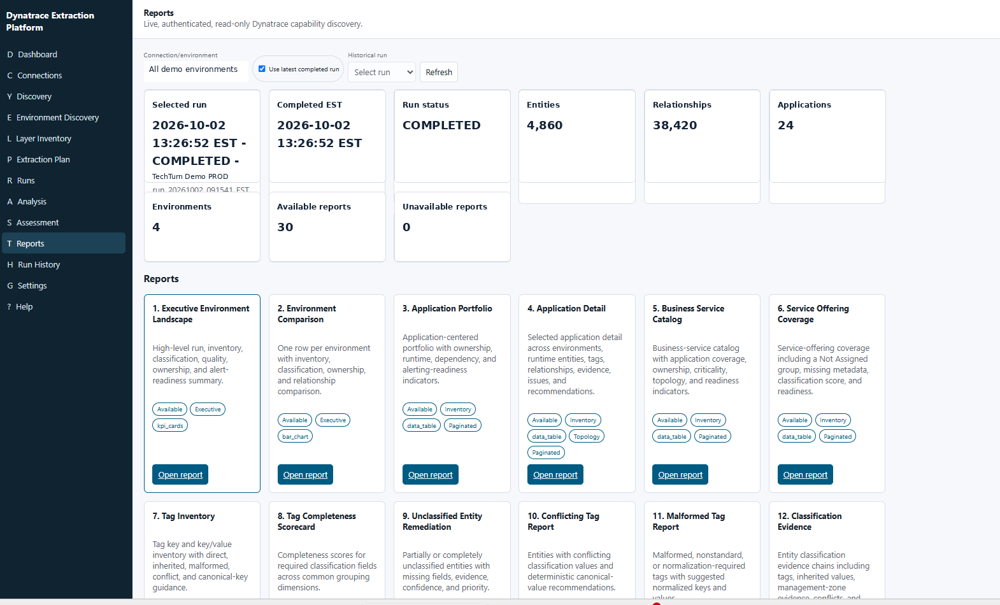
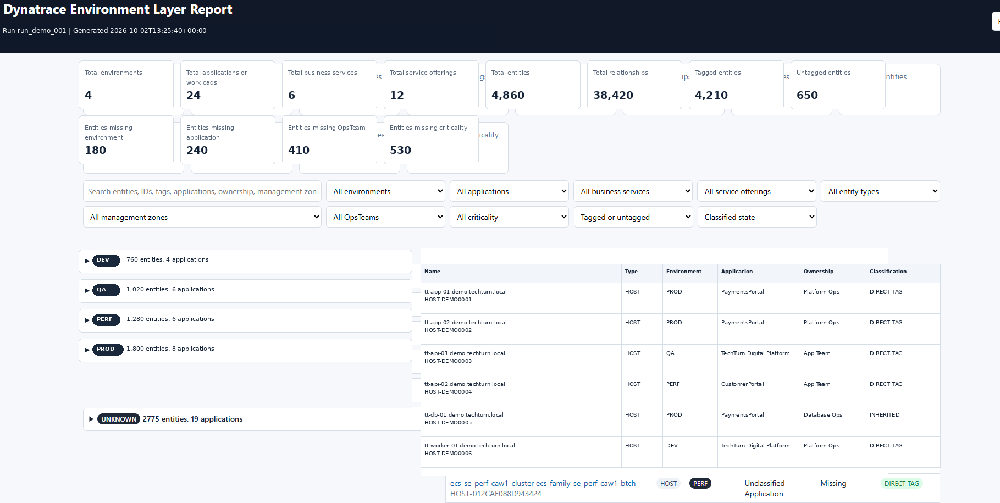
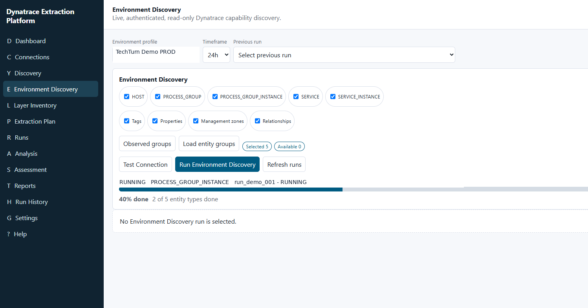

# TechTurn Dynatrace Environment Intelligence Platform

> **Discover, classify, map, assess, and document complex Dynatrace environments.**

The **TechTurn Dynatrace Environment Intelligence Platform** is a read-only discovery, analysis, assessment, and reporting solution designed to turn large Dynatrace environments into structured operational intelligence.

It connects to Dynatrace using authenticated read-only access, discovers monitored entities and configuration metadata, reconstructs application and environment hierarchy, evaluates classification and ownership quality, preserves evidence, and generates reports that can support architecture reviews, migration planning, governance, observability optimization, and operational readiness.

> **Important:** This repository is a public showcase. All screenshots and example data are synthetic or sanitized TechTurn demo data. No customer-specific information, credentials, tenant URLs, internal hostnames, IPs, application names, business-service names, internal IDs, or private topology data are intentionally published.

---

## Why this platform exists

Large Dynatrace environments can contain thousands of:

- hosts
- process groups and process-group instances
- services and service instances
- tags and entity properties
- management zones
- business-service mappings
- service-offering mappings
- ownership and criticality metadata
- topology relationships
- configuration objects and assessment evidence

Reviewing that information manually across many Dynatrace screens can make environment assessment, migration planning, governance, and standardization difficult.

This platform creates a persistent environment model so the data can be searched, classified, assessed, compared, and reported systematically.

---

## Platform workflow

```text
Dynatrace Environment
        │
        ▼
Authenticated Read-Only Connection
        │
        ▼
Environment Discovery
        │
        ├── Entities
        ├── Tags
        ├── Properties
        ├── Management Zones
        └── Relationships
        │
        ▼
Layer Inventory & Classification
        │
        ├── Environment
        ├── Application / Workload
        ├── Business Service
        ├── Service Offering
        ├── Ops Team / Owner
        ├── Criticality
        ├── Region
        └── Datacenter
        │
        ▼
Topology & Dependency Model
        │
        ▼
Assessment
        │
        ├── Missing metadata
        ├── Classification gaps
        ├── Ownership gaps
        ├── Tagging issues
        ├── Stale / inactive entities
        └── Readiness findings
        │
        ▼
Reporting
        │
        ├── Executive reports
        ├── Inventory reports
        ├── Evidence reports
        ├── Remediation reports
        └── Interactive Environment Layer Report
```

### Product story

**Connect → Discover → Model → Classify → Map → Assess → Report**

---

## Key capabilities

### 1. Secure read-only connectivity

The platform supports authenticated Dynatrace discovery while keeping the public showcase separate from any real customer credentials or environment information.

Typical connection functions include:

- saved environment profiles
- connection testing
- capability discovery
- permissions validation
- API paging and timeout controls
- TLS verification
- Environment API access
- OAuth-based access where applicable



---

### 2. Environment discovery

Environment Discovery builds the first normalized inventory of the selected Dynatrace environment.

The platform can discover entity categories such as:

- `HOST`
- `PROCESS_GROUP`
- `PROCESS_GROUP_INSTANCE`
- `SERVICE`
- `SERVICE_INSTANCE`

It also captures supporting metadata such as:

- tags
- properties
- management zones
- relationships



The result becomes the evidence layer used by later inventory, analysis, assessment, and reporting functions.

---

### 3. Layer inventory and classification

The **Layer Inventory** converts raw discovered entities into a more useful operating model.

It evaluates classification coverage across dimensions such as:

- business service
- service offering
- workload / application
- environment
- region
- datacenter
- operations team
- criticality



This makes it possible to identify where an environment has strong metadata coverage and where ownership or classification is incomplete.

---

### 4. Entity topology drill-down

Each entity can be inspected in context.

A host, service, process group, or other supported entity can be associated with:

- detected name
- entity type
- environment
- application/workload
- business service
- service offering
- ownership
- criticality
- management zones
- tags
- properties
- related hosts
- related services
- related process groups
- incoming relationships
- outgoing relationships



This makes the platform useful not only for inventory reporting, but also for understanding how an entity participates in the larger monitored topology.

---

### 5. Evidence-oriented analysis

The **Analysis** area exposes persisted normalized datasets instead of only high-level summaries.

Example analysis views include:

- entity-type summaries
- entity schemas
- management zones
- properties
- relationships
- tag analysis
- layer inventory datasets
- coverage summaries
- external entities
- host context





This provides traceability from a report or assessment finding back to the extracted evidence.

---

### 6. Assessment and remediation findings

The platform performs local assessment against the discovered and normalized environment model.

Example finding categories include:

- missing management-zone coverage
- missing tags
- incomplete classification
- stale or inactive entities
- ownership gaps
- environment metadata gaps
- dashboard or SLO readiness
- infrastructure findings
- evidence-preservation checks



The objective is not merely to identify issues, but to associate findings with evidence and remediation guidance.

---

### 7. Report catalog

The reporting layer is designed for different audiences and operational goals.

Example reports include:

- Executive Environment Landscape
- Environment Comparison
- Application Portfolio
- Application Detail
- Business Service Catalog
- Service Offering Coverage
- Tag Inventory
- Tag Completeness Scorecard
- Unclassified Entity Remediation
- Conflicting Tag Report
- Malformed Tag Report
- Classification Evidence



The report catalog allows the same discovery data to support executive review, engineering analysis, governance, and remediation planning.

---

## Flagship capability: Environment Layer Report

The **Dynatrace Environment Layer Report** is one of the platform's most important outputs.

It creates a searchable, navigable representation of a Dynatrace environment and links together:

```text
Environment
   └── Application / Workload
        └── Business Service
             └── Service Offering
                  ├── Hosts
                  ├── Process Groups
                  ├── Process Group Instances
                  ├── Services
                  └── Service Instances
```

It also preserves supporting context such as:

- tags
- entity properties
- ownership
- criticality
- classification source
- related hosts
- related services
- related process groups
- incoming topology relationships
- outgoing topology relationships



### Why this matters

Instead of opening many individual Dynatrace screens to reconstruct how an environment is organized, the report provides a point-in-time environment representation that can support:

- architecture review
- migration discovery
- observability governance
- ownership validation
- application rationalization
- monitoring standardization
- metadata cleanup
- operational readiness analysis

The real platform can generate very large reports for complex environments. The public repository intentionally does **not** contain any customer-generated report. A smaller synthetic TechTurn demo report will be used for public demonstration.

---

## Example TechTurn demo identity

All public examples use synthetic TechTurn naming.

| Category | Demo value |
|---|---|
| Company | TechTurn |
| Environment profile | TechTurn Demo PROD |
| Environments | DEV / QA / PERF / PROD |
| Primary application | PaymentsPortal |
| Platform application | TechTurn Digital Platform |
| Hosts | `tt-app-01`, `tt-app-02`, `tt-api-01`, `tt-api-02`, `tt-db-01` |
| Services | `payment-service`, `customer-service`, `gateway-service` |
| Business service | TechTurn Digital Payments |
| Service offering | Payments API / Gateway Services |
| Ops team | Platform Ops / Payments Team |
| Demo IP range | `192.0.2.0/24` |
| Demo run ID | `run_demo_001` |

---

## Public-demo security model

The showcase follows a strict public-data policy.

The public repository must not contain:

- customer names
- Dynatrace tenant URLs
- account or environment IDs
- real hostnames
- internal DNS names
- real IP addresses
- application names from customer environments
- internal business-service names
- service-offering names
- customer team or employee names
- email addresses
- real Dynatrace entity IDs
- API tokens
- OAuth client secrets
- private certificates
- internal file paths
- ticket numbers
- management-zone names
- internal topology identifiers
- confidential tags or metadata

### Sanitization strategy

Public artifacts use one of two approaches:

**Sanitized structure-preserving data**

Real identifiers are replaced with synthetic values while preserving the relationship structure.

**Fully synthetic public data**

Identifiers, counts, topology, applications, ownership, and environment details are generated as TechTurn demo data.

For GitHub Pages, LinkedIn, public demos, and sales material, the preferred mode is **fully synthetic public data**.

See [SECURITY.md](SECURITY.md) for the repository's public-data policy.

---

## Repository structure

```text
techturn-dynatrace-environment-intelligence/
│
├── README.md
├── SECURITY.md
├── CONTRIBUTING.md
│
├── screenshots/
│   ├── 01-connections.png
│   ├── 02-environment-discovery-running.png
│   ├── 03-environment-discovery-completed.png
│   ├── 04-layer-inventory.png
│   ├── 05-entity-topology-drilldown.png
│   ├── 06-analysis-entity-summary.png
│   ├── 07-analysis-properties.png
│   ├── 08-assessment.png
│   ├── 09-reports.png
│   └── 10-environment-layer-report.png
│
├── docs/
│   ├── index.html
│   ├── architecture.html
│   ├── demo.html
│   └── assets/
│       ├── images/
│       ├── css/
│       └── js/
│
├── demo/
│   └── environment-layer-report/
│       └── README.md
│
├── architecture/
│   └── README.md
│
└── examples/
    └── demo-data-model.md
```

---

## GitHub Pages plan

The `docs/` directory is reserved for the public showcase site.

Recommended public-site navigation:

```text
Home
├── Platform
├── Discovery
├── Environment Intelligence
├── Assessment
├── Reports
├── Interactive Demo
├── Architecture
└── Security
```

Recommended home-page sequence:

1. Hero
2. Problem
3. Platform workflow
4. Key capabilities
5. Environment Layer Report
6. Assessment and governance
7. Screenshots
8. Use cases
9. Architecture
10. Public-demo security
11. About TechTurn

---

## Planned interactive demo

A future public demo will provide a synthetic TechTurn environment with a smaller data set such as:

```text
PROD
├── PaymentsPortal
│   └── TechTurn Digital Payments
│       ├── Payments API
│       │   ├── payment-service
│       │   ├── tt-app-01
│       │   └── tt-app-02
│       └── Gateway Services
│           └── gateway-service
│
├── CustomerPortal
│   └── Customer Services
│       └── customer-service
│
└── TechTurn Digital Platform
```

The demo will be designed to show the same navigation and relationship model as a real environment without publishing customer information.

---

## Use cases

The platform is intended to support work such as:

- Dynatrace environment discovery
- AppDynamics-to-Dynatrace migration analysis
- Dynatrace-to-Dynatrace environment comparison
- observability governance
- application and service inventory
- ownership and criticality validation
- metadata and tagging review
- topology analysis
- migration readiness
- monitoring standardization
- alerting-readiness review
- dashboard-readiness review
- environment documentation
- audit evidence generation

---

## Design principles

The platform follows several operating principles:

- read-only discovery before configuration changes
- evidence before recommendation
- preserve raw and normalized outputs
- maintain traceability from finding to evidence
- classify entities consistently
- surface missing ownership and criticality
- separate informational visibility from actionable findings
- avoid exposing credentials
- keep public examples synthetic
- make large environments searchable and explainable

---

## Roadmap

Planned public-showcase capabilities include:

- [x] Read-only connection workflow
- [x] Environment discovery
- [x] Entity inventory
- [x] Tag/property discovery
- [x] Relationship extraction
- [x] Layer inventory
- [x] Classification coverage
- [x] Assessment findings
- [x] Report catalog
- [x] Environment Layer Report
- [ ] Fully synthetic interactive GitHub Pages demo
- [ ] Architecture diagrams
- [ ] Before/after environment comparison examples
- [ ] Alert-noise assessment examples
- [ ] Public sample datasets
- [ ] Automated sanitization profile
- [ ] Exportable public-demo report bundle

---

## Screenshots

### Connection


### Discovery in progress



### Discovery summary


### Layer inventory


### Topology drill-down


### Analysis


### Assessment


### Reports


### Environment Layer Report


---

## About TechTurn

**TechTurn** focuses on observability engineering, monitoring modernization, Dynatrace, AppDynamics, production support, SRE-oriented monitoring practices, migration tooling, and observability automation.

This repository demonstrates an engineering approach to understanding and improving complex Dynatrace environments. It is not an official Dynatrace product and is not affiliated with or endorsed by Dynatrace.

---

## Disclaimer

Dynatrace is a trademark of Dynatrace, LLC.

This repository is an independent TechTurn project and public technical showcase. Product names and trademarks belong to their respective owners.

No confidential customer information is intentionally included in this repository.

---

## Contact

For observability consulting, Dynatrace migration, monitoring optimization, or platform-engineering discussions:

**TechTurn IT Services Inc.**  
Email: `bsoni@techturn.ca`

---

## Status

**Public showcase:** In development  
**Interactive synthetic demo:** Planned  
**Customer data:** Not included
